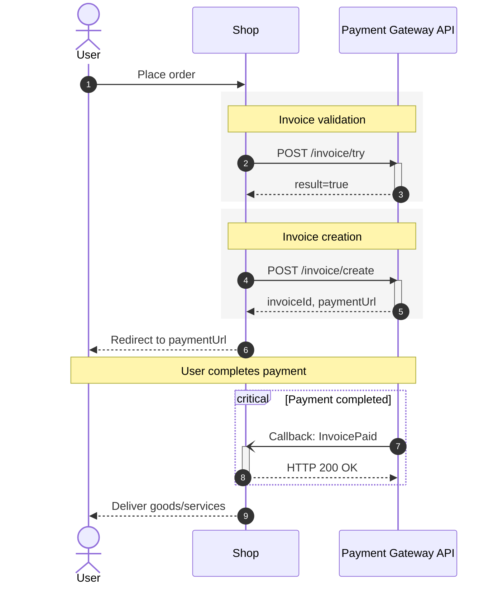
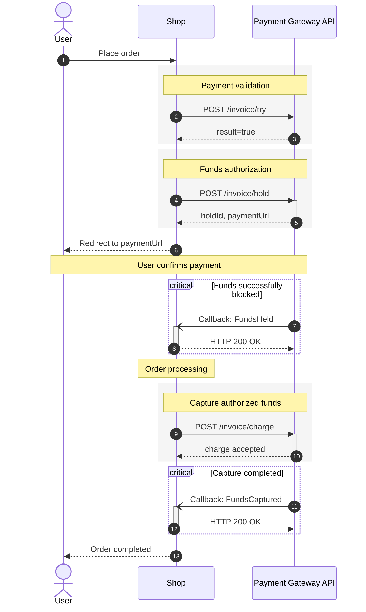

### Invoicing procedure

`Single-step payment` is a type of payment in which a single request [invoice/create](/api-reference/invoice-create/invoice-issue) is immediately blocking and withdrawing funds.

`Two-step payment` is a type of payment when funds are withdrawn in two steps. _You can check which payment ways support two-stage payment with the manager._ The first request [invoice/hold](/api-reference/invoice-create/funds-hold-two-stage-payments) is used to hold (block) funds on the client's account. The second request [invoice/charge](/api-reference/invoice-create/confirmation-of-funds-withdrawal-charge) initiates the withdrawal. If you want to cancel a previously held payment, then cancel it using the [invoice/unhold](/api-reference/invoice-create/cancellation-of-funds-holding) method. The money will be returned to the payer.

### Single-step payment

1. User generates an order on the shop's website;
2. Shop sends a request to pre-calculate the invoice and get additional parameters [invoice/try](/api-reference/invoice-create/invoice-preliminary-calculation);
3. When receiving `result: true`, verify the availability of additional information in `add_ons_config`, if present, it is necessary to pass additional parameters in the invoice request. When you get `result: false`, you need to analyse the error code in the `error_code` field (see [description of error codes](/errors-list)). If the `error code` is not fatal, then you need to wait for the [server notification](/callbacks). If the `error code` is fatal, then communication with our API is over.
4. After verifying [invoice/try](/api-reference/invoice-create/invoice-preliminary-calculation), the shop sends an invoice request [invoice/create](/api-reference/invoice-create/invoice-issue), specifying the required parameters and additional information from `add_ons_config` (if it is required for the specified payment direction);
5. The response returns information with the invoice and data to be sent by the specified method to the specified URL for making or charging the payment. It is necessary to send the user to make a payment. In case `result: false`, you need to analyse the error code in the `error_code` field (see [description of error codes](/errors-list)). If the `error code` is not fatal, then you need to wait for the [server notification](/callbacks). If the `error code` is fatal, then communication with our API is over, it is necessary to inform the user that the payment was not created.
6. After the payment is made or charged by the user, the M4  system [sends a notification](/callbacks) to the URL of interaction with the shop, containing payment information, for more information, see [here](/api-reference/invoice-create/invoice-issue);
7. After receiving the charge, the payment is considered successfully completed.

### Two-step payment

1. User generates an order on the shop's website;
2. Shop sends a request for a preliminary calculation of the issued invoice and receiving additional parameters [invoice/try](/api-reference/invoice-create/invoice-preliminary-calculation);
3. When receiving `result: true`, the availability of additional information in `add_ons_config` is checked, if present, additional parameters should be passed in the invoice request. When you get `result: false`, you need to analyse the error code in the `error_code` field (see [description of error codes](/errors-list)). If the `error code` is not fatal, then you need to wait for the [server notification](/callbacks). If the `error code` is fatal, then communication with our API is over.
4. After verification [invoice/try](/api-reference/invoice-create/invoice-preliminary-calculation) shop sends invoice request [invoice/hold](/api-reference/invoice-create/funds-hold-two-stage-payments), specifying the required parameters and additional information from `add_ons_config` (if it is required for the specified payment way);
5. The response returns information with the invoice issued and data to be sent by the specified method to the specified URL for making or charging the payment. It is necessary to refer the user to make the payment. In case `result: false`, you need to analyse the error code in the `error_code` field (see [description of error codes](/errors-list)). If the `error code` is not fatal, then you need to wait for the [server notification](/callbacks). If the `error code` is fatal, then communication with our API is over, it is necessary to inform the user that the payment was not created.
6. After payment is completed by the user, the M4  system [sends a notification](/callbacks) to the shop's interaction URL, with information about the blocking of funds;
7. After the funds are blocked on the client's account, you can charge the payment [invoice/charge](/api-reference/invoice-create/confirmation-of-funds-withdrawal-charge) or cancel the holding [invoice/unhold](/api-reference/invoice-create/cancellation-of-funds-holding);
8. The response returns information with the result of charge (sometimes the payment status may not be final, then you should wait for the notification);
9. M4 system [will send a notification](/callbacks) to the URL of the interaction of the shop with the final status regarding the confirmation of funds withdrawal.

### Ensuring payments idempotency

> **Warning:** The system has duplication protection for invoice creation, `shop_order_id` should be unique within a single shop.